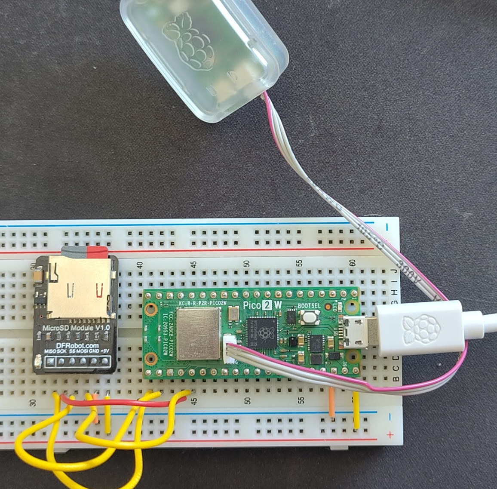

# Using egcode on the Raspberry Pico 2W

This folder contains a demonstration of how to use `egcode` in a `no_std` microcontroller setting which is where you will mostly likely decrypt gcode to be procssed by the CNC machine (e.g., a 3D printer). It also provides an example of how you can take advantage of the hardware SHA processor to speed offload and speed up the SHA calculations. It also shows how to implement `embedded-io` traits around `embedded_sdmmc` to be able to interface and stream directly with the `egcode`.



You will need a Pico 2W and SD card board, and have installed `probe-rs` and have a pico probe to flash the device.

You can run the demo by cloning the repo and `cd`ing into the directory and running:

```
cargo run
```

We have purposeflluy set the SHA iterations low for demonstration purposes. These should not be considered the recommended or default settings.
